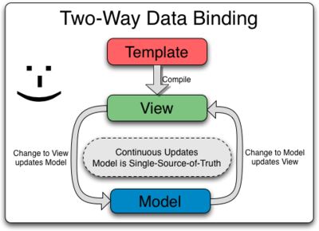
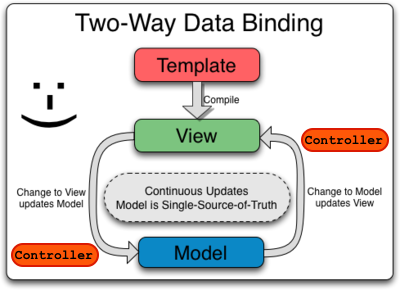
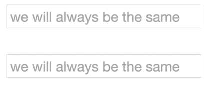
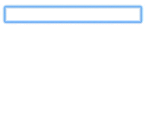
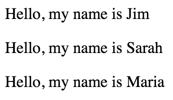

# Module 13: Angular

## Overview
This module is a _brief_ introduction to using the [Angular.js](https://angularjs.org/) framework. As your dynamic visualizations grow in complexity, you'll need to keep track of a slew of variables, data sources, and user interactions. Angular provides an incredibly useful structure for tracking information and organizing web applications, but requires that you understand how its components fit together. This module **only scratches the surface** of the framework, but should give you enough grounding to dive into the [next module](https://github.com/INFO-474/m14-angular-d3) on building D3 visualizations in an Angular application. While there's a bit of overhead to get started, **it's worth it**.

<!-- START doctoc generated TOC please keep comment here to allow auto update -->
<!-- DON'T EDIT THIS SECTION, INSTEAD RE-RUN doctoc TO UPDATE -->
**Contents**

- [Resources](#resources)
- [Model-View-Controller Structure](#model-view-controller-structure)
- [Angular in HTML](#angular-in-html)
  - [Directives](#directives)
  - [Expressions](#expressions)
- [Angular in JavaScript](#angular-in-javascript)
  - [Set-up](#set-up)
  - [$scope](#scope)
- [Reading Data](#reading-data)

<!-- END doctoc generated TOC please keep comment here to allow auto update -->

## Resources
Here are a few resources to get you started using Angular:

- [Angular.js Website](https://angularjs.org/)
- [Angular.js Tutorial](https://www.codecademy.com/learn/learn-angularjs) _(Codecademy)_
- [Angular.js Tutorial](http://www.w3schools.com/angular/default.asp) _(w3schools)_
- [Interactive Angular Activities](http://www.learn-angular.org/) _(learn-angular.org)_
- [Model-View-Controller Architecture](https://en.wikipedia.org/wiki/Model%E2%80%93view%E2%80%93controller) _(wikipedia)_
- [CSV to JSON Converter](https://shancarter.github.io/mr-data-converter/) _Shan Carter_
- [Angular HTTP Service](http://www.w3schools.com/angular/angular_http.asp) _w3schools_
## Why Use Angular for Visualization?
Before we consider the reasons for using Angular, we'll need to discuss the reasons for using a JavaScript framework _at all_. Unlike a **library**, which _provides a set of tools_ that makes web-development simpler, a **framework** _provides an architecture_ in which you structure your code. A framework helps keep your code organized by isolating common tasks (querying data, manipulating the DOM, etc.), and taking care of how they fit together. Frameworks often abstract away tasks that are difficult to keep track of, such as the _state_ of an application, event handlers, callback functions, etc.

As your visualizations scale in complexity, it becomes increasingly difficult to keep track of the state of your application -- which gender should be displayed on the chart? Which color encoding is currently being used? How do I move through a story? Did I propagate the data changes to _all_ relevant charts? Tracking this information in a variety of JavaScript variables is error prone and tedious. The Angular framework will enforce a consistent state between your data and your DOM, relieving you of the responsibility of updating the DOM whenever your data or a selection is changed.

## Model-View-Controller Structure
Angular uses a [Model-View-Controller](https://en.wikipedia.org/wiki/Model%E2%80%93view%E2%80%93controller)-like architecture that **abstracts data from visual representations**. The primary purpose of the MVC structure is ensure consistency throughout your application, alleviating the worry of figuring out when to update the DOM. At its core, the concept is simple: when the data (`model`) is changed, that change should be reflected on the DOM (`view`). This way, anytime a variable changes that should change the output, that change is made automatically (and without you having to write the code to do it).

A huge advantage of this structure is that your data (`model`) can be connected to multiple different representations on the DOM (`view`s). Now, instead of worrying about whether or not you've properly propagated changes to various DOM elements, all you have to do is make changes to your model, and Angular will take care of the rest.

One way to think about Angular is as an extensive templating system. Given a set of element types and relationships between them, you construct the web-page you want. However, what makes Angular unique is **two-way data binding**. Rather than simply bind data to particular elements and then render them on the DOM, Angular allows you to use the DOM to change the underlying data structure. In other words, you can **use your `view` to change your `model`**.  The [documentation](https://docs.angularjs.org/guide/databinding) depicts the relationship as follows:



But wait, what about the **C** in **MVC**? The controller performs the necessary business logic for your application. It helps manage fetching and preparing your data (`model`), which may happen repeatedly, depending on your application. I like to think of the controller as sitting between the `view` and the `model`, performing necessary checks on the inputs/outputs as they're developed:



Importantly, your `controller` will manage the data of your application as part of a variable it will define, `$scope`. More on this below...

## Angular in HTML
Enough theory -- let's get started. The basic structure of an Angular application requires that you define your **application** (`app`), and set up a `controller` for your application. Your `apps` and `controllers` be accessible as variables in both your HTML and JavaScript, but we'll begin by looking at the HTML syntax. Angular provides an **extended HTML vocabulary** that allows you to dictate element behavior by assigning **attributes** within HTML `<tags>`. These attributes all begin with the prefix `ng-`, and are referred to as **directives**.

### Directives
Angular **directives** allow you to assign certain behaviors or styles to HTML elements on your DOM. When an Angular webpage is compiled, angular will identify these tags and manipulate the DOM appropriately. The [documentation](https://docs.angularjs.org/guide/directive) provides this high level description of directives:

>At a high level, directives are markers on a DOM element (such as an attribute, element name, comment or CSS class) that tell AngularJS's HTML compiler (`$compile`) to attach a specified behavior to that DOM element (e.g. via event listeners), or even to transform the DOM element and its children.

Note, when the page is **compiled**, Angular may _"transform the DOM element and it's children"_. This allows you to use concise syntax to render a variety of HTML elements (without even writing JavaScript, yet). In order to signify to the Angular compiler _which part of the DOM to scan and manipulate_, we need to declare an Angular application with the `ng-app` directive:

>`ng-app`: Declares an Angular application within the element. You may specify an application name, such as `<div ng-app="myApp">`, but in our first few examples, we don't have any defined applications, so we'll use a nameless app by declaring `<div ng-app="">`.

The second step in defining our MVC system is to declare a **controller** using the `ng-controller` directive:

>`ng-controller`: Declares the Angular **controller** that manages the data (and corresponding logic) for your application. You can declare your controller in the same element as your application `<div ng-app="myApp" ng-controller="myCtrl">` or any child element. Because we haven't declare any named controllers in our JavaScript file yet, we can specify a nameless controller like this: `<div ng-app="" ng-controller="">`. While an app may have many controllers for different sections, simpler applications only have one controller.

Once we've established the area of the page for Angular to compile (using `ng-app`) and the desired data-source and corresponding logic (using `ng-controller`), we're able to start leveraging a variety of useful directives for declaratively building our DOM. First, we'll introduce the `ng-model` directive:

>`ng-model`: Declares a specific angular **model** you would like to bind to the element. This directive is commonly used with `<input>` elements, as they allow the user to update the underlying model with the given name. For example, you may want an input element to represent someone's first-name, so you could say `<input ng-model="firstName">`. Anytime the user edits the input box, the underlying model `firstName` will be changed, and those changes will be propagated throughout your application.


Here is a simple application in which multiple `input` elements have been bound to the same `model`.

```html
<!-- Define an unnamed angular application in your div element. -->
<div ng-app-"" ng-controller="">
  <div>
    <input ng-model="text" placeholder="we will always be the same"></input>
  </div>
  <div>
    <input ng-model="text" placeholder="we will always be the same"></input>
  </div>
</div>
```

The result of the app is that, anytime changes are made in one `input` element, those changes are reflected in the other one.



There are myriad useful Angular directives (a few of which we'll introduce below), and as you progress through your familiarity with Angular, you can even **write your own** directives (which is super cool). We'll now introduce another HTML syntax, commonly used in conjunction with certain directives, called **expressions**.

### Expressions
Another foundational concept of the extended HTML vocabulary Angular provides is the use of **Angular expressions**. _Expressions_ allow you to evaluate the value of an angular _model_ in your HTML element. As we'll describe more in depth below, `model` values are contained within the **scope** of an applications **controller**. In other words, if you had multiple different controllers, the model values could differ across them.

Expressions use **double curly braces** (`{{}}`) to indicate a model that Angular should evaluate. For example, if you had a model `firstName` that was set to `James`, the expression `{{firstName}}`, the Angular compiler would render `James` in your HTML. Here is a quick example. Note, `ng-bind` is similar to `ng-model`, but only renders the value (as opposed to allowing the `view` to update it).

```html
<!-- Define an unnamed angular application in your div element. -->
<div ng-app="" ng-controller="">
  <div>
    <input ng-model="greeting"></input>
  </div>
  <p>{{greeting}}</p>
</div>
```

That expression would render the following responsive DOM elements:



Here's one more exciting directive that will help showcase the value of using _expressions_: `ng-repeat`. This directive allows you to loop through elements **in your HTML**! An `ng-repeat` statement reads like a loop, where you specify a variable and pass in a set of values for that variable to take on. For example:

```html
<!-- Define an unnamed angular application in your div element. -->
<div ng-app="" ng-controller="">
  <p ng-repeat="name in ['Jim', 'Sarah', 'Maria']">Hello, my name is {{name}}</p>
</div>
```

That code section would evaluate the value of `{{name}}`, which would iterate through the array `['Jim', 'Sarah', 'Maria']`, creating a new paragraph element for each element in the array:



While this is a powerful start, the real value of using Angular is the way in which it connects elements in your JavaScript code to elements in the DOM.

## Angular in JavaScript
Don't worry -- Angular isn't just a new way to write HTML code -- it provides a way to translate from elements in your JavaScript code to elements in the DOM. In your JavaScript code, you can create elements such as **applications** and **controllers**, which you can reference in your HTML.

### Set-up
Using JavaScript, you can create the _applications_ that you reference in your HTML using the `ng-app` directive. The basic syntax for creating an application is to use the `angular.module` method which takes in two parameters: an **application name**, and an **array of dependencies**. We won't be using any dependencies for our applications in this learning module, though it's important to understand how Angular uses [dependency injection](https://docs.angularjs.org/guide/di) to provide an application (or any other component) with the necessary building blocks. Here is an example of specifying an Angular module called `my-app` that has _no dependencies_:

```javascript
// Declare an Angular module `my-app` with no dependencies, store it in a variable for reference
var app = angular.module('my-app', []); // note the empty array of dependencies is required
```

Note the empty array of dependencies is **required** for this to execute properly. Once we have a module defined, we can define a controller for our module. Note, Angular supports **method chaining**, so there's technically no need to keep the module defined in a variable:

```javascript
// Declare an Angular module `my-app` with no dependencies, store it in a variable for reference
var app = angular.module('my-app', []); // note the empty array of dependencies is required

// Assign a controller `my-ctrl` to our application
app.controller('my-ctrl', function($scope) {
  // Set initial application state in here by attaching properties to $scope -- see below
});

```

Our controller takes in two parameters: a name (`my-ctrl`), and a **constructor function** that has access to a number of variables, most importantly `$scope`.

### $scope
The `$scope` variable is what will allow you to expose data from your `model` to your `view`. By attaching properties to the `$scope` variable, these properties become accessible as `model` element in your HTML. For example, imagine we had simple profit calculator in our HTML:

```html
<!-- Initiate a nameless application and controller -->
<div ng-app="" ng-controller="">
  <!-- Create an input for quantity, bound to the model `quantity` -->
  <label>Quantity:<input type="number" ng-model="quantity"></input></label><br/>

  <!-- Create an input for price, bound to the model `price` -->
  <label>Price:<input type="number" ng-model="price"></input></label><br/>

  <!-- Display the profit by using an expression that multiples together `quantity` and `price` -->
  <p><strong>Profit:</strong>{{quantity * price}}</p>
```

This would work just fine, but doesn't allow us to set initial values. However, if we specify the values for `price` and `quantity` as part of the `$scope` variable, those will be exposed to our HTML elements. We can even do our computation in our `$scope` variable, and expose it in our JavaScript. We, of course, would have to use the application and controller names in our `ng-app` and `ng-controller` tags.


```html
<!-- Initiate a nameless application and controller -->
<div ng-app="profit-app" ng-controller="profit-ctrl">
  <!-- Create an input for quantity, bound to the model `quantity` -->
  <label>Quantity:<input type="number" ng-model="quantity"></input></label><br/>

  <!-- Create an input for price, bound to the model `price` -->
  <label>Price:<input type="number" ng-model="price"></input></label><br/>

  <!-- Display the profit by using an expression that runs the `getProfit` function -->
  <p><strong>Profit:</strong> {{getProfit()}}</p>
```

```javascript
// Declare an Angular module `profit-app` with no dependencies, store it in a variable for reference
var app = angular.module("profit-app", []);

// Declare an Angular controller `profit-ctrl`, and attach values onto the $scope
app.controller('profit-ctrl', function($scope){
  // Set initial values
  $scope.quantity = 5;
  $scope.price = 100;

  // Define a function that computes the profit
  $scope.getProfit = function() {
    return $scope.quantity * $scope.price;
  }
});
```

The Angular compiler watches for changes to the models, so the `getProfit` function will be fired automatically, and the changes will be reflected in the DOM.

## Reading Data
If you're doing data-visualization, you'll likely need to read some data into your application. Angular provides a variety of approaches for reading in data, but we'll focus on the `$http` service in this section.

Similarly to `$scope`, `$http` is a predefined variable in Angular with specific behaviors. In order to leverage the variable within your controller, you need to include it in your constructor function:

```javascript
app.controller('my-ctrl', function($scope, $http){
  // Set up controller
});
```

The `$http` variable functions quite similarly to an AJAX request that fetches data from a URL and **returns a promise**. This means that you need to wait until the promise completes in order to use the data and execute your code. Here is an example of fetching data in an application that **only needs to make one call to the server for data**:

```javascript
app.controller('my-ctrl', function($scope, $http){
  // Read in JSON data, then execute the function on success
  $http.get('my-file.json').then(function(response){
    $scope.data = response.data.nodes;
  })
});
```

The `response` variable is an object containing information about the request, and the `.data` property contains the object returned by the request. As you might expect, the `$http` method is also great for querying data from APIs.

Unfortunately, `$http` **does not** have built in ways for dealing with .csv data. A simple work around is to [convert your csv to json](https://shancarter.github.io/mr-data-converter/), or, as suggested [here](http://stackoverflow.com/questions/16933711/how-to-load-csv-file-to-object-in-angualrjs), parse your csv in your browser ([blog post](http://www.bennadel.com/blog/1504-ask-ben-parsing-csv-strings-with-javascript-exec-regular-expression-command.htm) on the topic).

Again, this learning module just scratches the surface of working with Angular. The framework provides a variety of other methods for building robust web applications, and there is excellent extensibility for [multipage architecture](http://angular-ui.github.io/ui-router/site/#/api/ui.router). 
